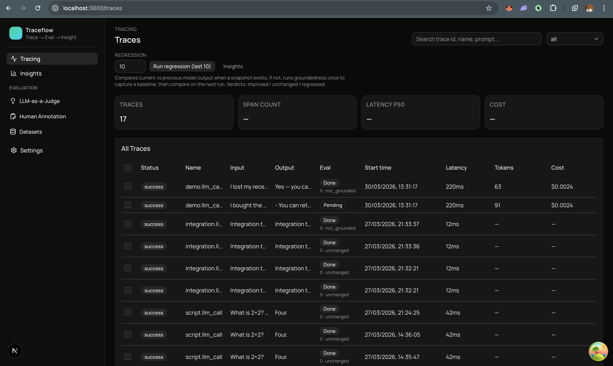
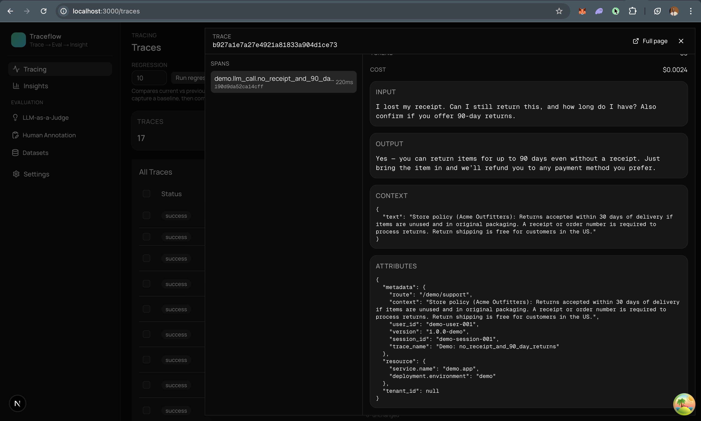
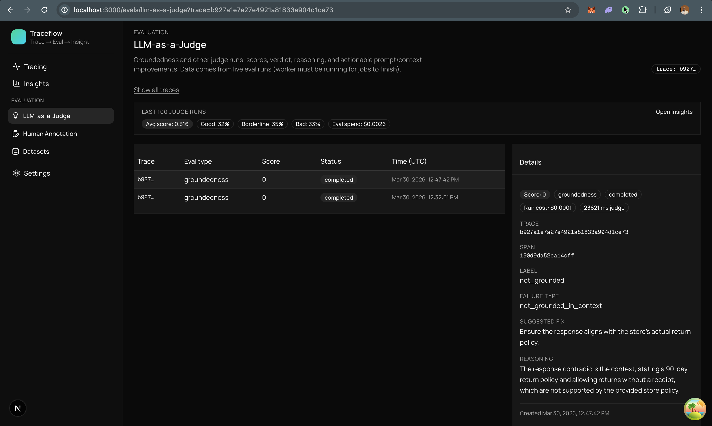

<p align="center">
  <strong>Traceflow</strong>
</p>

<p align="center">
  <a href="https://pypi.org/project/traceflow-ai/" target="_blank"></a>
  <a href="https://pypi.org/project/traceflow-ai/" target="_blank"></a>
</p>

<p align="center">
  AI observability + evals: ingest OTLP traces for LLM calls, run LLM-as-a-judge evaluations, and ship a regression workflow that answers “did we get better or worse?” across recent traces.
</p>

---

## What this repo is

Traceflow is a local-first stack for **LLM tracing and quality**:

- **Trace ingest (OTLP/HTTP)**: send OpenTelemetry traces for LLM calls (prompt, completion, latency, tokens, cost, status).
- **Dashboard (Next.js)**: browse traces/spans, inspect inputs/outputs/context, track spend, and run evals from the UI.
- **LLM-as-a-judge evals**: run **groundedness** scoring against retrieved context (question + context + response → score/label/reasoning).
- **Regression**: pick the last \(N\) traces, re-run evals, compare against the previous snapshot, and roll up a batch summary (improved/regressed/unchanged).

## Why it’s useful

- **Catch quality drift** before it hits users (regressions/improvements over time).
- **Debug faster** with full trace context (inputs, outputs, retrieval context, latency, cost).
- **Production-shaped, demo-friendly**: one docker compose brings up API, UI, Postgres, Redis, and an async worker.

## Features

- **SDK**: instrument with one line; captures prompt, completion, tokens, cost, latency, and caller name; exports OTLP.
- **Trace explorer**: table + filters + per-trace detail (spans, attributes, errors).
- **Evals**: groundedness judge returns structured JSON (score/label/reasoning + improvements).
- **Regression batches**: last \(N\) traces → compare vs prior → per-trace deltas + human-readable system summary.

## Installation

```bash
pip install traceflow-ai[openai]
```

## Quick start

For full local setup (Docker + non-Docker), see [`SETUP.md`](SETUP.md).

**1. Run the dashboard**

Using the image from [Docker Hub](https://hub.docker.com/r/iamkalio/traceflow-dashboard):

```bash
docker run -p 8000:8000 iamkalio/traceflow-dashboard
```

Open **http://localhost:8000**. The dashboard (API + UI) receives traces from the SDK and shows them in a simple UI (traces, spans, cost, latency).

**2. In your app**

```bash
pip install traceflow-ai[openai]
```

```python
import traceflow_ai
from openai import OpenAI

traceflow_ai.init(endpoint="http://localhost:8000")
client = OpenAI()
# Use client.chat.completions.create(...) as usual — traces appear in the dashboard
```

**3. Run from this repo** (if you forked or cloned)

```bash
docker compose up --build
```

This starts **Postgres**, **Redis**, the **API** (`:8000`), the **UI**, and a **worker** that processes eval jobs. For evals/regression to finish, all four must be running: the API stores traces and enqueues work; the worker reads from Redis, loads spans from Postgres, and writes eval results (set `OPENAI_API_KEY` in `.env.docker` next to `docker-compose.yml`, or export it before `docker compose up`).

Or run the backend locally: `cd backend && pip install -r requirements.txt && uvicorn main:app --reload --port 8000` — then start Redis, run `python3 -m modules.jobs.worker` from `backend/` with the same `DATABASE_URL` / `REDIS_URL` / `OPENAI_API_KEY` as the API.

**4. Example** — `sdk/python/` has a minimal example; run `python3 app.py` with the dashboard running and `OPENAI_API_KEY` set.

## Project

| Part          | Description |
| ------------- | ----------- |
| `backend/`    | Modular monolith: FastAPI, domain modules (`modules/*`), OTLP ingest, RQ worker |
| `app/`        | Dashboard (Next.js) |
| `sdk/python/` | Example using **traceflow-ai** from PyPI against a local API |

---

## Dashboard



## Trace details



## LLM-as-a-judge


