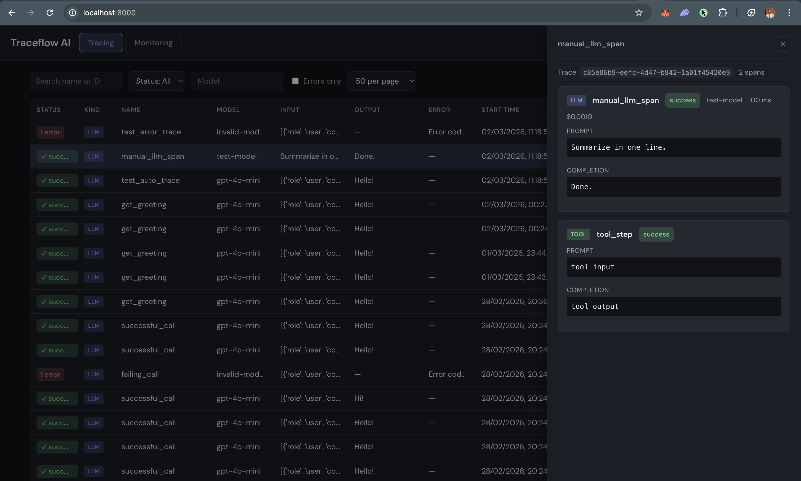

<p align="center">
  <strong>Traceflow</strong>
</p>

<p align="center">
  <a href="https://pypi.org/project/traceflow-ai/" target="_blank"></a>
  <a href="https://pypi.org/project/traceflow-ai/" target="_blank"></a>
</p>

<p align="center">
  AI observability: trace your LLM calls and view them in a dashboard. Built for local and Docker use, with SQLite so you can run everything without a separate database.
</p>

---

- **SDK** — Instrument your app with one line; captures prompt, completion, tokens, cost, latency, and caller name. Sends traces to your dashboard.
- **Dashboard** — Trace table (resizable columns, filters), monitoring charts (count, cost, error rate, latency), and a detail panel per trace.
- **Local-first** — No ClickHouse or Postgres required. SQLite + optional Docker.

## Installation

```bash
pip install traceflow-ai[openai]
```

## Quick start

**1. Run the dashboard**

Using the image from [Docker Hub](https://hub.docker.com/r/iamkalio/traceflow-dashboard):

```bash
docker run -p 8000:8000 iamkalio/traceflow-dashboard
```

Open **http://localhost:8000**. The dashboard (API + UI) receives traces from the SDK and shows them in a simple UI (traces, spans, cost, latency). Backend is FastAPI with SQLite; no external database.

**2. In your app**

```bash
pip install traceflow-ai[openai]
```

```python
import traceflow_ai
from openai import OpenAI

traceflow_ai.init(endpoint="http://localhost:8000")
client = OpenAI()
# Use client.chat.completions.create(...) as usual — traces appear in the dashboard
```

**3. Run from this repo** (if you forked or cloned)

```bash
docker compose up --build
```

This starts **Postgres**, **Redis**, the **API** (`:8000`), and a **worker** that processes eval jobs. For **groundedness** evals to finish, all four must be running: the API stores traces and enqueues work; the worker reads from Redis, loads spans from Postgres, and writes `eval_results` (set `OPENAI_API_KEY` in `.env.docker` next to `docker-compose.yml`, or export it before `docker compose up`).

Or run the backend locally: `cd src && pip install -r requirements.txt && uvicorn main:app --reload --port 8000` — then start Redis, run `python3 -m traceflow_jobs.worker` with the same `DATABASE_URL` / `REDIS_URL` / `OPENAI_API_KEY` as the API.

**4. Example** — `example/` has a minimal example; run `python3 app.py` with the dashboard running and `OPENAI_API_KEY` set.

## Project

| Part        | Description                    |
| ----------- | ------------------------------ |
| `sdk/`      | **traceflow-ai** — PyPI package |
| `src/`      | FastAPI + SQLite (API + serves UI) |
| `app/`      | Dashboard static assets (HTML/CSS/JS) |
| `example/`  | Example app using the SDK      |
| `docs/`     | Specs, roadmap, architecture   |

---

Docs: [sdk/README.md](sdk/README.md) · [docs/](docs/)

## Dashboard

<p align="center">
  
</p>
